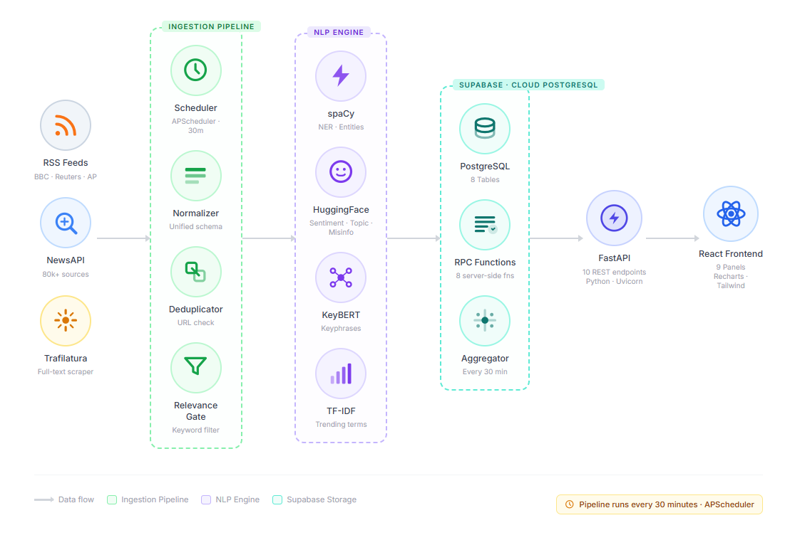
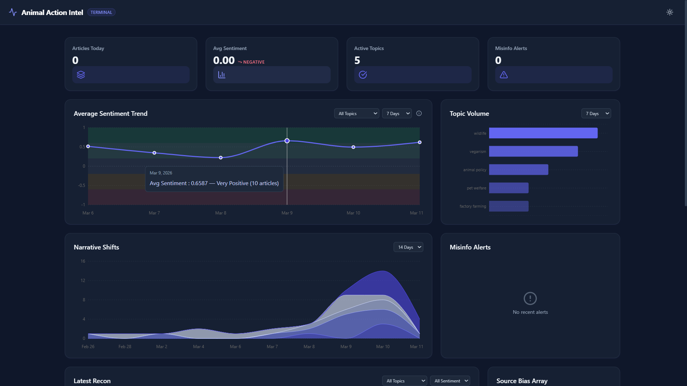
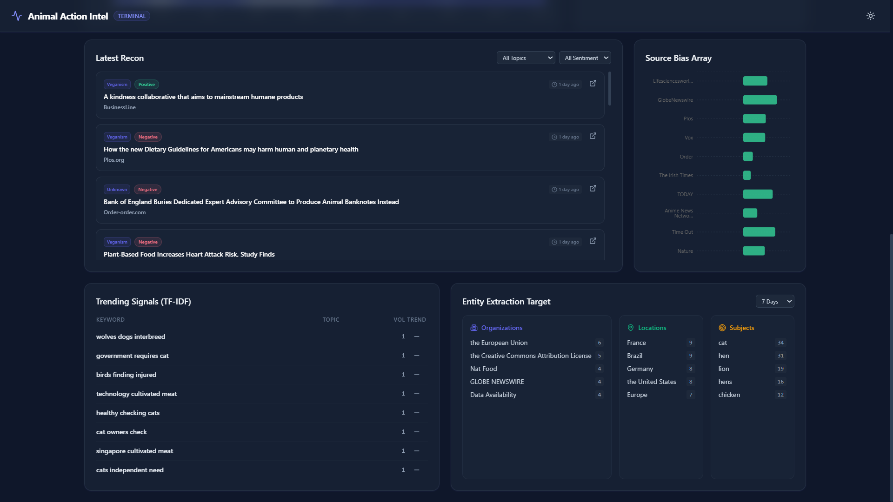

<div align="center">

<h1>Animal Welfare News Sentiment Tracker</h1>
<p><strong>AI-powered news intelligence for animal welfare strategy, monitoring, and trend detection.</strong></p>

<p>


</p>
</div>

## Index

- [One liner](#one-liner)
- [Architecture diagram](#architecture-diagram)
- [Tech stack](#tech-stack)
- [Frontend preview](#frontend-preview)
- [Features](#features)
- [System architecture](#system-architecture)
- [Repository structure](#repository-structure)
- [Getting started](#getting-started)
- [Deployment](#deployment)
- [Environment variables](#environment-variables)
- [API endpoints](#api-endpoints)
- [Database schema](#database-schema)
- [License](#license)

## One liner

This project ingests animal welfare news, filters out irrelevant coverage, scores each story through an animal welfare lens, and turns the result into a fast dashboard for strategy, monitoring, and trend analysis.

**Live Demo:** https://animal-action-intel.vercel.app/

## Architecture Diagram



## Tech Stack

| Layer | Technologies | What they do |
|---|---|---|
| Frontend | React 18, Vite 5, Recharts, Axios, date-fns, Lucide React | Dashboard UI, charts, filters, API calls |
| Backend | Python 3.13, FastAPI, Uvicorn, APScheduler | REST API, scheduler, ingestion orchestration |
| Database | Supabase, PostgreSQL | Core storage, RPC-backed analytics queries |
| Ingestion | RSS, NewsAPI, Trafilatura, requests, feedparser, python-dateutil | Collects articles and extracts full text |
| AI and NLP | spaCy, HuggingFace Inference API, YAKE | Entities, topic classification, domain-aware sentiment, misinfo scoring, keyphrases |
| Infrastructure | Render for backend, Vercel-ready frontend deployment | Hosting and deployment workflow |

### AI stack

| Task | Tool or Model | Notes |
|---|---|---|
| Relevance filtering | Weighted keyword scoring | Title match = 2, body match = 1, threshold = 2 |
| Sentiment | `facebook/bart-large-mnli` | Zero-shot, scored from an animal welfare perspective |
| Topic classification | `facebook/bart-large-mnli` | Zero-shot across 6 welfare topics |
| Misinformation review | `mrm8488/bert-tiny-finetuned-fake-news-detection` | Suspicion score for review, not a verdict |
| Entity extraction | spaCy `en_core_web_sm` | Organizations, locations, animals |
| Keyphrases | YAKE | Lightweight local extraction with no model download |

## Frontend Preview

### Dashboard view 1



### Dashboard view 2



## Features

- Multi-source ingestion from RSS feeds and NewsAPI
- Full-text enrichment with Trafilatura and fallback text assembly
- Weighted relevance gate to reject weak or noisy matches before NLP runs
- Animal-welfare-aware sentiment scoring instead of generic news sentiment
- Zero-shot topic classification across factory farming, wildlife, animal testing, pet welfare, animal policy, and veganism
- Misinformation review queue with suspicion scores and flag reasons
- Entity extraction for organizations, locations, and animals
- Keyphrase extraction and trending signal detection
- Daily topic summaries and precomputed metrics for fast API responses
- Spike detection for sudden narrative shifts
- 9-panel React dashboard with charts, ranked lists, article feed, and health monitoring endpoint

## System Architecture


The flow is straightforward. The backend pulls articles from RSS and NewsAPI, scrapes full text, normalizes the payload, removes duplicates, and runs a weighted relevance gate. Relevant articles then pass through NLP steps for sentiment, topic, entities, misinfo scoring, and keyphrases. The processed data is stored in Supabase Postgres. Aggregator jobs compute daily summaries, trending keywords, and spike events. FastAPI serves this precomputed data through lightweight endpoints, and the React frontend renders it into a dashboard with charts, ranked insights, and recent article monitoring.

## Repository Structure

```text
Animal_welfare/
├── README.md
├── render.yaml
├── backend/
│   ├── main.py
│   ├── pyproject.toml
│   ├── requirements.txt
│   ├── config/
│   │   ├── settings.py
│   │   └── keywords.py
│   ├── db/
│   │   ├── database.py
│   │   └── migrations/
│   │       ├── init.sql
│   │       └── supabase_rpc_functions.sql
│   ├── ingestion/
│   │   ├── scheduler.py
│   │   ├── rss_fetcher.py
│   │   ├── newsapi_fetcher.py
│   │   ├── scraper.py
│   │   ├── normalizer.py
│   │   ├── deduplicator.py
│   │   └── relevance_gate.py
│   ├── nlp/
│   │   ├── pipeline.py
│   │   ├── spacy_processor.py
│   │   ├── sentiment.py
│   │   ├── topic_classifier.py
│   │   ├── misinfo_detector.py
│   │   ├── keybert_extractor.py
│   │   └── hf_api.py
│   ├── aggregator/
│   │   ├── daily_summary.py
│   │   ├── tfidf_keywords.py
│   │   └── spike_detector.py
│   ├── api/
│   │   └── routes/
│   │       ├── metrics.py
│   │       ├── sentiment.py
│   │       ├── topics.py
│   │       ├── narrative.py
│   │       ├── articles.py
│   │       ├── keywords.py
│   │       ├── entities.py
│   │       ├── spikes.py
│   │       └── sources.py
│   └── tests/
├── frontend/
│   ├── package.json
│   ├── public/
│   └── src/
│       ├── App.jsx
│       ├── main.jsx
│       ├── index.css
│       ├── hooks/
│       │   ├── api.js
│       │   └── useApiData.js
│       ├── components/
│       │   ├── Dashboard.jsx
│       │   ├── panels/
│       │   └── ui/
│       └── assets/
└── docs/
        ├── logo.svg
        ├── architecture.png
        ├── frontend-page1.png
        ├── frontend-page2.png
        ├── architecture.md
        ├── data-flow.md
        ├── documentation.md
        ├── feature-list.md
        ├── module-requirements.md
        ├── module-specifications.md
        ├── thinking-process.md
        └── future-scope.md
```

The repository is organized around one clear pipeline. The `backend` folder handles ingestion, NLP, aggregation, and API delivery. The `frontend` folder contains the Vite React dashboard. The `docs` folder keeps the architecture, implementation notes, screenshots, and design thinking in one place so the product, code, and documentation stay aligned.

## Getting Started

### Prerequisites

- Python 3.13+
- Node.js 18+
- npm
- `uv` for Python dependency management
- A Supabase project
- Optional API keys for NewsAPI and HuggingFace Inference API

### 1. Clone the repository

```bash
git clone <your-repo-url>
cd Animal_welfare
```

### 2. Set up the database in Supabase

Open the Supabase SQL Editor and run these files in order:

1. [backend/db/migrations/init.sql](backend/db/migrations/init.sql)
2. [backend/db/migrations/supabase_rpc_functions.sql](backend/db/migrations/supabase_rpc_functions.sql)

This creates the tables and RPC functions used by the API and the aggregators.

### 3. Configure backend environment variables

Copy [backend/.env.example](backend/.env.example) to `backend/.env` and fill in the values.

```bash
cd backend
copy .env.example .env
```

### 4. Install backend dependencies

```bash
cd backend
uv sync
```

If the spaCy model is not already available, install it:

```bash
uv run python -m spacy download en_core_web_sm
```

### 5. Start the backend

```bash
cd backend
uv run uvicorn main:app --reload
```

Backend URLs:

- API root: `http://localhost:8000`
- Health check: `http://localhost:8000/health`
- OpenAPI docs: `http://localhost:8000/docs`

### 6. Configure frontend environment variables

Create `frontend/.env` and add:

```env
VITE_API_URL=http://localhost:8000
```

### 7. Install frontend dependencies

```bash
cd frontend
npm install
```

### 8. Start the frontend

```bash
cd frontend
npm run dev
```

The Vite dev server will print the local URL, usually `http://localhost:5173`.

## Deployment

### Backend deployment on Render

The backend already includes a Render config in [render.yaml](render.yaml).

#### Render flow

1. Push the repository to GitHub
2. Create a new Render Web Service
3. Point the service to the repository root
4. Render will detect [render.yaml](render.yaml)
5. Set the required environment variables in Render
6. Deploy

#### Current Render settings

| Setting | Value |
|---|---|
| Runtime | Python |
| Root directory | `backend` |
| Build command | `pip install -r requirements.txt && python -m spacy download en_core_web_sm` |
| Start command | `uvicorn main:app --host 0.0.0.0 --port $PORT` |
| Region | Singapore |

### Frontend deployment on Vercel

The frontend is a standard Vite app and is ready for Vercel deployment.

#### Vercel flow

1. Import the repository into Vercel
2. Set the root directory to `frontend`
3. Use the default Vite build command: `npm run build`
4. Use the default output directory: `dist`
5. Add `VITE_API_URL` and point it to the deployed backend URL
6. Deploy

### Deployment note

This repository currently includes direct deployment config for the backend on Render. The frontend deployment is straightforward on Vercel, but no Vercel config file is required for the current setup.

## Environment Variables

### Backend

| Variable | Required | Default | Description |
|---|---|---|---|
| `SUPABASE_URL` | Yes | none | Supabase project URL |
| `SUPABASE_KEY` | Yes | none | Supabase anon public key used by the backend |
| `HF_API_TOKEN` | Recommended | empty | HuggingFace Inference API token for sentiment, topic, and misinfo |
| `NEWSAPI_KEY` | Recommended | empty | NewsAPI key for broader article discovery |

### Frontend

| Variable | Required | Default | Description |
|---|---|---|---|
| `VITE_API_URL` | Yes for deployment, optional locally | `http://localhost:8000` | Base URL of the FastAPI backend |

## API Endpoints

The app currently exposes 11 HTTP endpoints, not 38. The full implementation detail lives in [docs/module-specifications.md](docs/module-specifications.md) and the live schema is available at `/docs` when the backend is running.

| Method | Path | Purpose | Key query params |
|---|---|---|---|
| GET | `/health` | Health check for hosting and uptime monitoring | none |
| GET | `/overview/metrics` | Dashboard summary metrics | none |
| GET | `/sentiment/trend` | Daily sentiment trend by topic | `topic`, `days` |
| GET | `/topics/volume` | Topic volume over a date range | `days` |
| GET | `/narrative/shifts` | Topic volume series for narrative charts | `days` |
| GET | `/articles/recent` | Recent processed articles | `limit`, `topic`, `sentiment`, `source` |
| GET | `/articles/flagged` | Misinfo review queue | `limit` |
| GET | `/trending/keywords` | Trending animal-welfare keyphrases | none |
| GET | `/entities/top` | Top organizations, locations, and animals | `days`, `limit` |
| GET | `/spikes/active` | Active spike events | none |
| GET | `/sources/sentiment` | Source-level article volume and average sentiment | `limit`, `days` |

## Database Schema

### Tables

| Table | Purpose |
|---|---|
| `articles` | Canonical article records with source metadata and processing state |
| `sentiment_scores` | Animal-welfare sentiment label and score per article |
| `topics` | Topic classification per article |
| `entities` | Extracted organizations, locations, and animal terms |
| `flagged_articles` | Misinfo review queue with suspicion scores |
| `keyphrases` | Extracted keyphrases per article |
| `trending_keywords` | Precomputed trending phrases |
| `daily_summaries` | Daily per-topic rollups for counts and sentiment |
| `spike_events` | Topic spikes and active alert state |

### Views

No SQL views are defined in the current version. The project relies on materialized application tables plus Supabase RPC functions for aggregate reads.

### RPC functions

Defined in [backend/db/migrations/supabase_rpc_functions.sql](backend/db/migrations/supabase_rpc_functions.sql).

| Function | Purpose |
|---|---|
| `rpc_daily_summary_stats` | Summary counts and average sentiment for a topic in a time window |
| `rpc_topic_volumes` | Topic volume over a date range |
| `rpc_top_entities` | Top entities by type and time range |
| `rpc_source_sentiment` | Source-level article count and average sentiment |
| `rpc_overview_metrics` | Dashboard metric card aggregates |
| `rpc_recent_articles` | Recent articles with filters and joined NLP fields |
| `rpc_flagged_articles` | Flagged articles for review |
| `rpc_keyphrase_counts` | Keyphrase frequency for trending computation |

### Schema sources

- Table DDL: [backend/db/migrations/init.sql](backend/db/migrations/init.sql)
- RPC DDL: [backend/db/migrations/supabase_rpc_functions.sql](backend/db/migrations/supabase_rpc_functions.sql)

## License

This repository does not currently include a license file. If this project is intended for open reuse, adding an MIT license would be the simplest next step.

